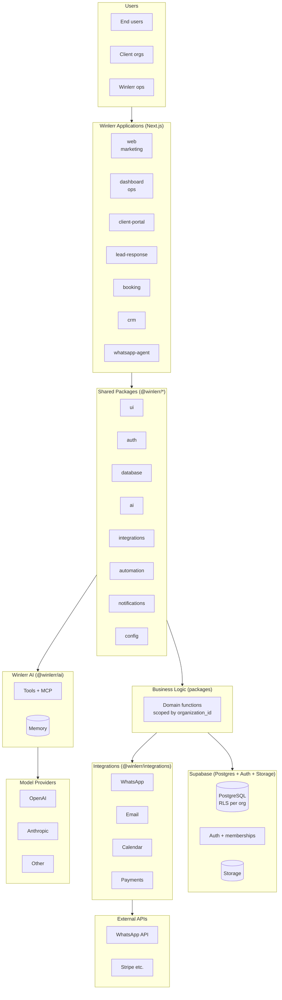
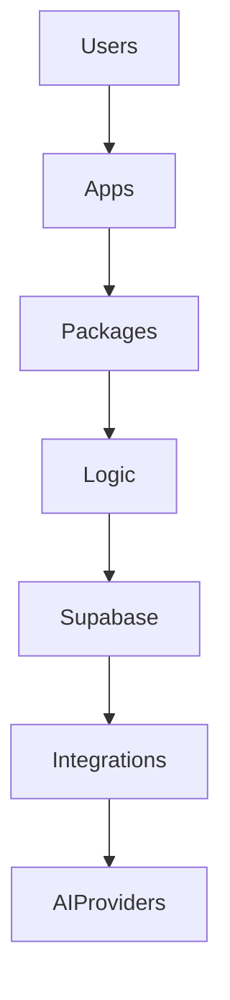

# Winlerr — System Overview

- **Last updated:** 2026-08-21 — Architecture audit (feature/architecture-audit, baseline 275d221)
- **Status:** Current Plan (establishes model, see ADRs 0001–0005)
- **Related:** `repository-audit.md`, `database-architecture.md`, `authentication.md`, `api-architecture.md`, `ai-architecture.md`, `integrations.md`, `security.md`

## 1. Purpose

Winlerr is a reusable business automation platform. One shared foundation powers multiple products (CRM, booking, lead-response, client-portal, WhatsApp agent) without rebuilding auth, DB, AI, or UI per product. The architecture is a **modular monolith** (ADR 0002) deployed on Supabase + Vercel + Cloudflare.

## 2. Architecture Map



Simplified per spec requirement:



## 3. Repository Structure

```
winlerr/
├── apps/           # product surfaces (Next.js) — placeholders until first product ships
│   ├── web, dashboard, client-portal, lead-response, booking, crm, whatsapp-agent
├── packages/       # shared libraries — imported by apps, never circular
│   ├── ui, auth, database, ai, integrations, automation, notifications, config
├── services/       # logical namespace — not deployed as microservices yet (ADR 0002)
│   ├── api, workers, webhooks, agents
├── infrastructure/ # IaC / env
│   ├── cloudflare, vercel, supabase/migrations, environments
├── docs/
│   ├── architecture/ (this folder)
│   ├── decisions/ (ADRs 0001–0005)
│   ├── products/, integrations/, development/
├── scripts/
├── .github/workflows/ci.yml
├── AGENTS.md, README.md, package.json, pnpm-workspace.yaml, turbo.json
```

## 4. Application Boundaries (Existing, placeholders — Current Plan)

| App | Purpose | Status |
|-----|---------|--------|
| `web` | Public marketing/landing (winlerr.vip) | Future application — placeholder until first marketing build |
| `dashboard` | Winlerr ops/admin | Future application |
| `client-portal` | Client-facing environment | Future application |
| `lead-response` | Capture, process, response automation + workflows | Future application — first candidate for real build |
| `booking` | Appointment/scheduling | Future application |
| `crm` | Contacts, pipelines, activities | Future application |
| `whatsapp-agent` | WhatsApp AI + automation | Future application — requires `@winlerr/ai` + `@winlerr/integrations` |

Only build an app when HQ confirms its scope. One app can evolve without destabilizing others due to package isolation.

## 5. Package Boundaries

| Package | Import | Allowed to depend on | Responsibility |
|---------|--------|----------------------|---------------|
| `@winlerr/ui` | `packages/ui` | (none beyond react) | Shared components, design system |
| `@winlerr/auth` | `packages/auth` | `@winlerr/database`, `@winlerr/config` | Supabase auth wrappers, requireUser/Membership/Permission, RLS helpers — sole auth surface |
| `@winlerr/database` | `packages/database` | `@winlerr/config` | Browser/server/admin Supabase clients, typed helpers, org scoping, no business logic |
| `@winlerr/ai` | `packages/ai` | `@winlerr/config` | Provider registry (OpenAI/Anthropic), tools (Zod), agents, MCP, memory, evals — sole AI surface |
| `@winlerr/integrations` | `packages/integrations` | `@winlerr/config` | WhatsApp, email, calendar, payments adapters — sole provider-specific surface |
| `@winlerr/automation` | `packages/automation` | `database, auth` | Workflow primitives — consumes auth/database |
| `@winlerr/notifications` | `packages/notifications` | `integrations, config` | Multi-channel (email/WhatsApp/in-app) |
| `@winlerr/config` | `packages/config` | (none) | eslint + tsconfig presets, env validation |

Dependency direction: `apps/services → packages → config/database/ai`, acyclic, no `packages → apps`.

## 6. Services (Logical, not deployed — Proposal)

| Service | Path | When it becomes a deployable |
|---------|------|------------------------------|
| `api` | `services/api` | Only when cross-app HTTP contract needed outside Next.js |
| `workers` | `services/workers` | When cron/queues need isolated scaling (otherwise Vercel Cron/pg_cron) |
| `webhooks` | `services/webhooks` | When Edge Function isolation needed (otherwise Route Handler) |
| `agents` | `services/agents` | When agent runtime needs isolation (otherwise library in `@winlerr/ai`) |

Until then, logic lives in Route Handlers + Supabase Edge Functions within the monolith.

## 7. Database Platform

- Supabase (Postgres + Auth + Storage + Realtime) — ADR 0003.
- Migrations: `infrastructure/supabase/migrations/<timestamp>_<name>.sql`, RLS per table, tenant via `organization_id`.
- Model: `organizations → users → memberships → roles/permissions → products → product data` (see `database-architecture.md`).

## 8. Deployment Direction

| Layer | Platform | Config |
|-------|----------|--------|
| Apps | Vercel (initially 1 project, per-app when validated) | `infrastructure/vercel/` |
| Edge/DNS | Cloudflare | `infrastructure/cloudflare/` |
| DB/Auth/Storage | Supabase (one project per env) | `infrastructure/supabase/` |
| Env config | Staging vs prod (non-secret) | `infrastructure/environments/` |

Branch → env: `feature/* → local/preview`, `develop → staging`, `main → production` (ADR 0005). Secrets via dashboards, never Git. No auto-prod without explicit promotion.

## 9. AI Architecture Direction

`@winlerr/ai` is provider-agnostic: unified `chat()`, registry, Zod tools, bounded permissions, audit logging, MCP layer. Apps never import `openai`/`anthropic` directly. Writes require human approval or scoped policy (see `ai-architecture.md`).

## 10. Domain Examples (Illustrative, not configured)

```
winlerr.vip, www.winlerr.vip
dashboard.winlerr.vip, app.winlerr.vip
leadresponse.winlerr.vip, booking.winlerr.vip, crm.winlerr.vip
```
Subdomain per product only when validated; start consolidated.

## 11. Decisions

- ADR 0001 monorepo — Established
- ADR 0002 modular monolith — Established
- ADR 0003 Supabase/Postgres — Established
- ADR 0004 authentication model — Current Plan (needs HQ review)
- ADR 0005 environment strategy — Established

## 12. See Also

- `repository-audit.md` — what exists / missing / incorrect / unnecessary / recommended
- `docs/decisions/` — ADRs 0001–0005
- `AGENTS.md` — engineering rules
- `.env.example` — env source of truth
